# Composition Guide · The Rhizomatic Specimen-Card Series

**Essentials Creative · applied composition layer · v0.4.1 — 2026-06-06**

> **Added in v0.2:** §12 a card read end-to-end · §13 the border & emblem index · §14 the living-type
> system · §15 the relations lexicon · §16 the naming worksheet.
> **Added in v0.3:** §17 blocks of expression (*blocs of sensation*) — the deck to keep in mind.
> **Added in v0.4:** measured corrections (real dimensions + sampled hexes) · visual evidence
> (thumbnails + the corpus index) · **failure modes** on every block · §18 production & the
> print-school layer · §19 **worked forward** — a new card built from scratch · §20 the concept
> library (generative seeds for future work). *This version turns the guide from a description of past
> work into an engine for making new work.*

> This is the *making* companion to the design system. `system.html` (the broadside) holds the
> theory and the print-school lineage; `tokens.json` holds the color/space spine; `protocol.html`
> holds consent and licensing; the `decisions/` ADRs hold the law. **This file holds the grammar of
> the picture itself** — how a Rhizomatic card is actually composed, so a new plant or figure can be
> built into one without re-deriving the system each time.
>
> It is **descriptive, not generative.** It records the grammar *you* already authored across the
> series so you can repeat your own hand deliberately. Per **ADR-0005**, nothing here instructs an AI
> to author, complete, or fill the border patterns, the heritage names, or any Indigenous-attributed
> motif. Those are the consented, hand-sourced core (see §8).

Read against the four-step synthesis (ADR-0001): **Mingei · Sōsaku-hanga · Zen (Notan/Ma/Iki/Mitate)
· Productive contradictions.** The grammar below is how those lenses land on a physical layout.

---

## 0. The corpus at a glance

The 25 works this grammar is drawn from. Every measured value and sampled hex below comes from these
files (`assets/guide-thumbs/manifest.json`). This is the evidence; the rules are the pattern read off
it.

@contact
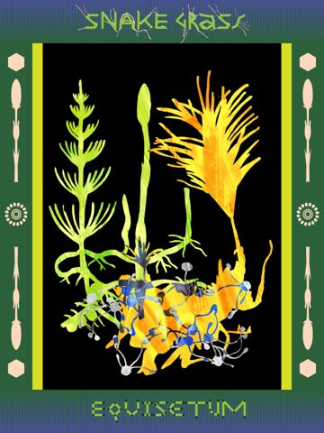
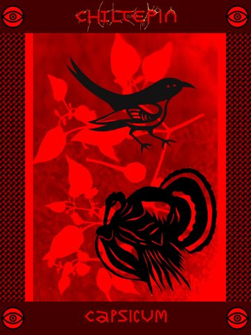
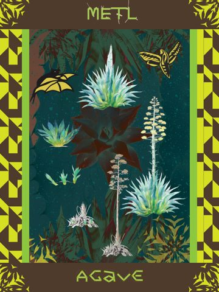
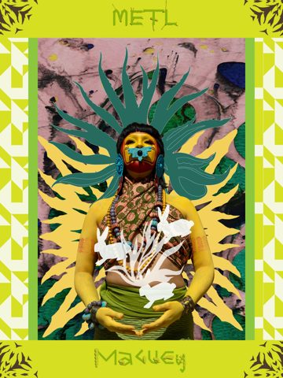
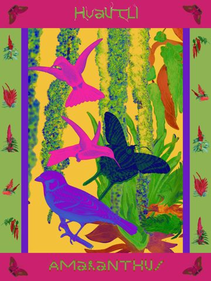
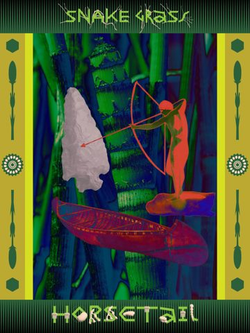
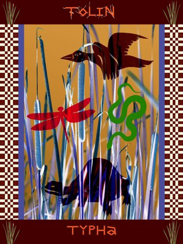
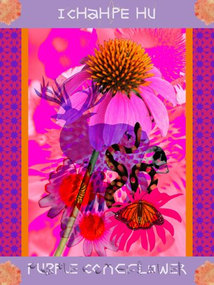
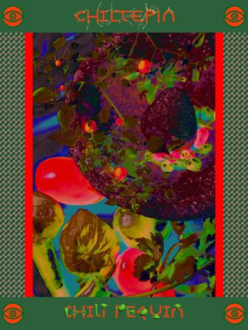
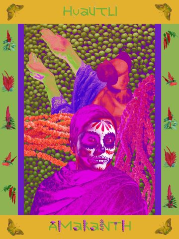
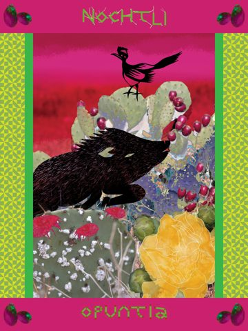
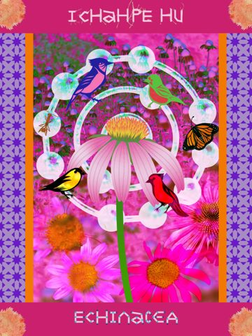
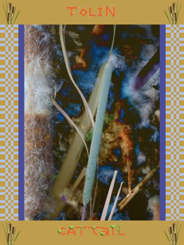
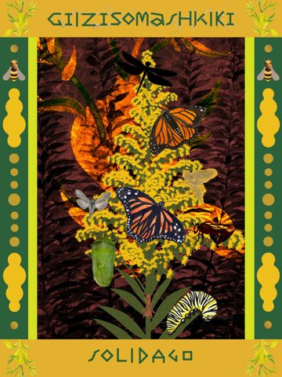
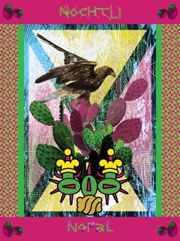
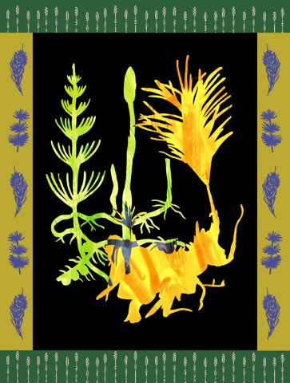
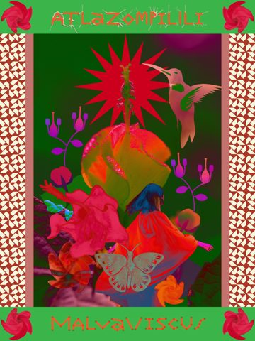
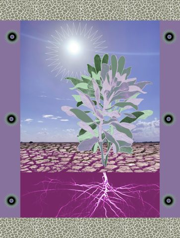
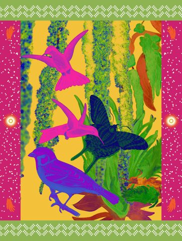
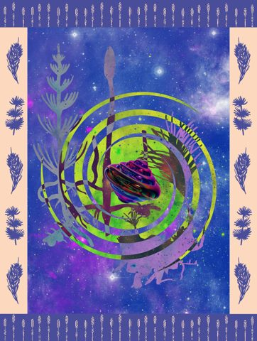
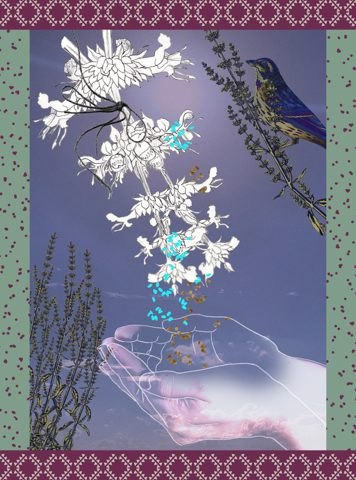
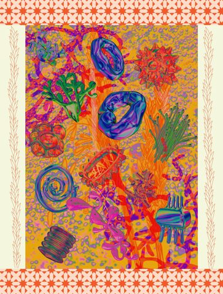
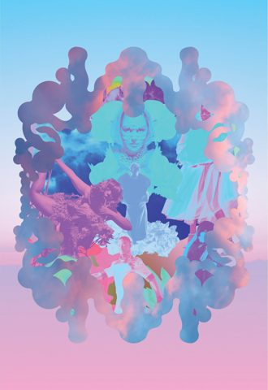
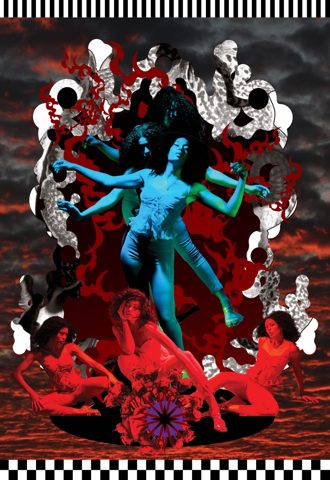
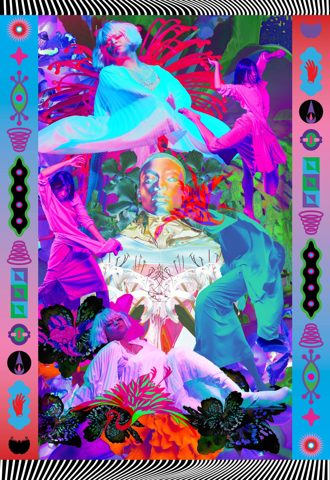

---

## 1. The form in one sentence

> A portrait **specimen plate** — herbarium-meets-lotería-meets-tarot — where a single named being
> (plant or person) is held inside a **four-band heritage frame**, rendered in **stacked collage
> registers** at near-fluorescent chroma, with the name **grown from the subject's own material**.

If a new piece breaks that sentence on purpose, that's a *datsuzoku* rule-break (allowed, one per
piece) — not a mistake. Name which clause you're breaking and why.

---

## 2. The canvas

| Property | Value | Why |
|---|---|---|
| **Orientation** | Portrait | The specimen stands; the body stands. Plate/broadside reading. |
| **Ratio** *(measured)* | Specimen cards **3:4 exactly** (1920×2560); Afterworld figures **11:16** (1760×2560, =0.6875) | Two distinct proportions — the card is squarer, the figure poster is taller. |
| **Master size** *(measured)* | **1920×2560 px** native (cropped variants ~1936×2560); long edge **2560 px** | Don't downscale below this for masters; export web siblings from it. |
| **Margin / ma** | Frame occupies the outer **~12–18%** per side; inner window keeps the **40–60% ma breathing budget** (`ref.spacing.ma-7`) | The void inside the window is charged, not leftover. |

---

## 3. The four-band frame (the signature)

This is the single most identifying device of the series — present in **every** card. The filename
says it: `Border_Type`. Four zones, read clockwise from top:

### 3a. Top band — the **heritage name**
- The being's name in its **Indigenous / ancestral register**: Nahuatl (`METL`, `HUAUTLI`, `TOLIN`,
  `NOCHTLI`, `ATLAZOMPILLI`), Lakota (`ICHAHPE HU`), Ojibwe (`GIIZISOMASHKIKI`), or a common-tongue
  name (`SNAKE GRASS`, `CHILTEPIN`).
- Set in a **living display face**: letterforms **built from the subject's own matter** — root-twigs,
  rhizomes, seeds, sprouts, bone, thorn. This is the core **mitate** of the series: *the name is not
  typeset, it is grown.* Horsetail's name ends in jointed-stem glyphs; Amaranth's in seed-heads;
  Chiltepin's in cracked-pepper-skin strokes.
- One band-color, flat, drawn from the card's key (often the *complement* of the inner field).

### 3b. Bottom band — the **botanical / Latin name**
- The binomial or English common name (`EQUISETUM`, `CAPSICUM`, `OPUNTIA`, `SOLIDAGO`, `ECHINACEA`,
  `MALVAVISCUS`, `PURPLE CONEFLOWER`).
- **Same living-type treatment, different color** from the top band. Top and bottom are a *call and
  response* — two namings of one being, never identical.

> **Productive contradiction (Serizawa):** the card names the being **four ways at once** — ancestral
> tongue, Linnaean Latin, English common, and material-glyph. Keep all four alive. Do not let the
> scientific name dominate the ancestral one, or vice versa (ADR-0004: grounded center, honored
> traces).

### 3c. Left + right bands — the **textile pattern columns**
- Vertical **serape/weave geometry**: checkerboard, diamond-tessellation, triangle-weave, X-blocks,
  plaid, dot-field, stepped fret. The two sides usually **mirror** each other.
- These carry **emblem medallions** at the **corners and mid-points** — small repeated marks **keyed
  to the subject's ecological kin or cultural charge**:
  - Equisetum/Snake Grass → spear-leaf + rosette + hexagon
  - Chiltepin → the **red eye**
  - Maguey/Agave → agave-spike fret
  - Amaranth → chile sprigs + butterflies
  - Tolin/Cattail → cattail sprigs
  - Nochtli/Opuntia → prickly-pear tunas
  - Solidago → bees + pollen-dots
  - Echinacea → coneflower-orange tufts
- **These bands and emblems are the consented heritage core.** They are hand-built or member-sourced
  through the Hanga Protocol — never auto-generated (§8).

### 3d. The picture window
- A bright **keyline** (lime, orange, magenta, green) separates frame from image — a hard
  electric edge, 8–20 px. It is the proscenium. The drama happens behind it.

---

## 4. The collage registers (the layers)

Every card is **3–5 stacked registers**. The discipline is: **one dominant rendering mode for the
hero**, with the other registers in *different* modes so the eye can separate them. Mixing registers
is the point — it is the *visual* form of "many worlds fit" (Escobar, pluriversal).

Bottom → top:

1. **GROUND** — the field. One of five recurring grounds (§5).
2. **HERO** — the named subject, largest, center-weighted. Rendered in **exactly one** mode:
   - *Cut-paper silhouette* on void (Equisetum, Snake Grass) — purest notan.
   - *Botanical watercolor* (Agave/Metl, the white-sage leaf).
   - *Solarized / inverted photograph* (Horsetail, Chili Pequin, Cattail) — naturalistic source made
     electric by inversion.
   - *Hyper-real saturated photo* (Echinacea, Purple Coneflower blooms).
3. **SECONDARY ACTORS** — pollinators & relations: hummingbirds, monarchs, hawk-moths, finches,
   cardinals, dragonflies, snakes, turtles, peccary, roadrunner, golden eagle. Usually **flat
   silhouettes or color-shifted cutouts**, placed upper/mid field. They *swarm the still specimen* —
   the live around the pressed.
4. **DIAGRAM / LINE OVERLAY** — thin white contour: molecular bond-rings (Echinacea, Amaranth),
   seed-fall arcs (White Sage), botanical outline. The "science" register, held as line.
5. **GLYPH** (occasional) — a single Mesoamerican or symbolic mark (Nopal's eagle-temple glyph, the
   border eyes). Used sparingly; one per card maximum.

**Rule of separation:** if two registers collapse into one read (e.g., a watercolor hero on a
watercolor ground of the same value), push one to a different mode or value. The layers must stay
legible *as layers* — that legibility is the collage.

**Rule of zones** *(added v0.4.1, from the §19 mesquite run):* when two registers want the same area
— a diagram line and an underworld flat both claiming the lower third — the register **closer to the
hero's meaning holds the zone**, and the other yields: it crosses as *line only*, or retreats to a
margin. Never split a zone 50/50 between two registers; pick a holder. (In §19, meaning sat with the
underworld flat, so the taproot crossed it as line.)

---

## 5. The five grounds

Pick one. The ground sets the metaphysical key.

| Ground | Reads as | Example | Token cue |
|---|---|---|---|
| **Void black** | specimen on the page; pure notan | Equisetum, Snake Grass | `page-inverted` (`sumi`) |
| **Saturated monochrome wash** | charged field, one element | Chiltepin (red), Agave (teal) | a single `ref.ink` pushed to chroma |
| **Solarized / inverted photo** | the real made uncanny | Horsetail, Cattail, Chili Pequin | invert a documentary source |
| **Hyper-real bloom photo** | abundance, immersion | Echinacea, Purple Coneflower | full-saturation macro |
| **Landscape + underworld** | above/below, root-cosmos | White Sage (cracked earth + magenta root realm) | `page` over `murasaki` |

The five grounds, one example each — squint at the thumbnails and the difference is structural, not
decorative:

---

## 6. Color discipline

- **Tight key, hot clash.** 3–5 hues per card, with **at least one high-clash complementary pair**:
  acid-green × black, red × black, magenta × yellow-green, teal × coral, hot-pink × lime.
- **Push to near-fluorescent.** Saturation runs higher than nature. Documentary photos are
  **inverted/solarized** so source greens read electric.
- **Frame inverts field.** The border palette comes from the same key but usually flips temperature
  against the inner window (warm frame / cool field, or vice versa) so the window pops forward.
- **Anchor to the spine.** Where you can, key cards to the `tokens.json` referents — `shu` (cinnabar /
  monarch), `ai` (aquifer indigo / Baptisia), `suo` (cochineal on nopal), `wakatake` (agave/sotol),
  `kihada` (milkweed flower), `fuji` (mountain laurel), `murasaki` (the Coyolxāuhqui purple). The
  series chroma is a *push past* these naturalistic anchors — keep the anchor identifiable underneath.

> **Iki (restraint) check:** chroma this hot needs one place to rest. Most strong cards have a single
> low-saturation hold — the black void, a neutral silhouette, a band of unsaturated paper. If
> everything screams, nothing leads. Withhold one element.

**Sampled keys (measured from the masters)** — these are the actual dominant hues, not a mood board.
Read each row as *clash pair + rest tone*:

- Equisetum — void + chartreuse, slate rest:
  @swatch #000000 #376045 #CCC747 #333C4A
- Chiltepin (Capsicum) — red on near-black:
  @swatch #D10000 #BE0303 #4E0001 #1B0304
- Solidago — goldenrod on dark earth:
  @swatch #E2B12E #E0CA22 #422D1C #763B19
- Echinacea — magenta heat, near-white **rest tone**:
  @swatch #F90499 #DE267D #D3CBD1 #883172
- Mictlán — red/black underworld, pale ash relief:
  @swatch #6B0F10 #110A0A #852A26 #B5CED5
- Moksha — pastel iridescent ascension (no clash; all rest — the exception that proves the rule):
  @swatch #D2B1D3 #6AC9E6 #8BCDEF #BEA5CB

Note Moksha breaks the clash rule on purpose (its affect is dissolution, not heat) — a *datsuzoku*
break at the palette level. Most cards do **not** have that license; earn it.

---

## 7. Notan & hierarchy (squint test)

Read order, largest → smallest pull:

1. **Name banner** (top) — entry.
2. **Hero subject** — center mass, the value/chroma peak.
3. **Secondary actors** — the swarm; second-pass discoveries.
4. **Ground texture** — atmosphere.
5. **Frame emblems** — the slow read, the ecology in the margins.

**Squint at every card before it ships.** Strip the color and the light/dark structure must still
carry the composition — a dark hero mass against a luminous window, or a luminous specimen on void.
The cut-paper black-ground cards (Equisetum) are the reference standard: pure notan. If a card only
works in full color, the notan is doing no work — push it.

---

## 8. The bright line, in *this* series (ADR-0005)

The series' culturally-grounded core is concentrated in **§3a–3c**: the heritage **names**, the
**living-type letterforms**, the **textile border patterns**, and the **emblem medallions**. These
carry Otomí / Purépecha / Nahua / Lakota / Ojibwe and other lineage charge.

- These are authored or sourced **by hand, through earned relationship and the Hanga Protocol** —
  member-drawn marks routed via `~/Tools/sketch-to-svg/`, or consented sources. **Never** ask a
  generative model to invent, complete, or "fill more pattern" here.
- If a layout feels empty and the impulse is "more border," the consent-first move is: *draw it, carve
  it, or source it through relationship.* The **honored absence is visible and waiting** (per the
  changelog's "honored absences" list — Tenango, amate, maque, Apache coil, Adinkra, etc.) until it is
  member-sourced and consented. The empty slot is part of the argument, not a gap to close.
- The **generative-safe** zones, by contrast, are the artist's own collage operations: inversion,
  solarization, recolor, silhouette extraction, layout, and the artist's own drawn/painted hero and
  pollinator elements.

---

## 9. The Afterworld variant (figure cosmology)

The same frame DNA, retuned from botany to **metaphysical state**. Seen in *Moksha · Mictlán ·
Purgatory*.

| Shifts from the specimen card | Afterworld move |
|---|---|
| Subject | **Human figure(s)**, not a plant — a central frontal body with **radial/mandala symmetry**, secondary figures (dancers) arrayed around. |
| Side bands | **Invented glyph-totem columns** (eyes, vessels, spirals, hand, butterfly silhouettes) instead of botanical emblems — vertical symbolic stacks. |
| Symmetry | **Kaleidoscopic mirroring** + strong central axis (vs. the cards' naturalistic asymmetry). |
| Color = state | Mictlán = red/black fire underworld; Moksha = pastel iridescent third-eye ascension; Purgatory = neon-jungle suspension. The palette *is* the cosmology. |
| Frame | Carved **flame / cloud / bone silhouette** wreath around the figure (evenodd negative space). |

Same disciplines apply: one dominant hero register, notan under the chroma, one place to rest, the
bright line on any cultural glyphwork.

---

## 10. Build sequence (a repeatable order of operations)

1. **Choose the being** and gather its **four names** (ancestral · Latin · common · material).
2. **Choose the ground** (§5) — this fixes the metaphysical key.
3. **Set the key palette** (§6): one clash pair + one rest tone, anchored to the spine.
4. **Place the hero** in one render mode, center-weighted; protect the 40–60% ma.
5. **Add 1–3 secondary actors** (the swarm) in a *different* register from the hero.
6. **Add at most one** diagram/line overlay and **one** glyph.
7. **Build the frame** (§3) — hand-sourced names + member/consented patterns + ecology-keyed emblems.
8. **Grow the type** from the subject's matter; top & bottom in call-and-response colors.
9. **Squint test** (§7) — fix the notan before any color polish.
10. **Iki pass** — find the one over-stated element and withhold it. Declare your one *datsuzoku*
    rule-break.

---

## 11. Ship checklist

- [ ] Portrait, ~3:4 (card) or ~11:16 (figure); master 1920×2560 / 2560 px long edge.
- [ ] All **four bands** present; **two namings** in call-and-response colors; type **grown from the
      subject's matter**.
- [ ] Side emblems **keyed to the subject's ecological/cultural kin**, hand-sourced.
- [ ] **3–5 registers**, hero in one dominant mode, layers legible *as layers*.
- [ ] Tight key, **one clash pair + one rest tone**; frame temperature inverts the field.
- [ ] **Notan holds in grayscale.**
- [ ] **40–60% ma** preserved; the void is charged.
- [ ] **Bright line clean** — no AI-authored heritage names/patterns/glyphs (§8).
- [ ] One declared *datsuzoku* break; nothing else fighting it.
- [ ] jpg **+ webp** siblings for web (gallery-add workflow).

---

## 12. A card read end-to-end

Two worked reads, so the grammar is seen *applied* rather than only listed. These describe pieces you
already authored — they are recall, not instruction.

### 12a. *Snake Grass / Equisetum* — the notan reference standard

@swatch #000000 #376045 #CCC747 #333C4A

The black-ground horsetail card is the cleanest statement of the system; learn the form here.

- **Ground (§5):** pure **void black**. No atmosphere — the specimen is the whole event. This is why
  the card survives a grayscale squint better than any other: the notan is the design.
- **Hero (§4.2):** *Equisetum* in **cut-paper silhouette**, one register only — a chartreuse fertile
  shoot, a yellow-orange brush-fan, a green sterile stem with whorled branches. Brushy internal
  striation keeps the paper alive (the maker's hand — Mingei honesty, not a flat fill).
- **Secondary actors (§4.3):** the blue-and-silver **sporeling chain** strung along the base — a
  *different* register (wet, beaded, translucent) from the dry cut-paper hero, so the layers separate.
  The "swarm around the still specimen" is here a microscopic one: spores, not pollinators.
- **Type (§3a–b):** top **SNAKE GRASS** grown from **root-twigs**; bottom **EQUISETUM** grown from
  **jointed horsetail-stem** glyphs — the letters literally are the plant's segmented anatomy. Top
  green, bottom green-on-violet: call and response.
- **Frame (§3c):** violet-and-green woven side bands; **peach emblems** — hexagon (corner), spindle
  (mid-upper), beaded rosette (mid) — the abstracted **strobilus/cone** geometry of the plant, keyed.
- **Palette (§6):** key = chartreuse × black with a yellow-orange clash and one violet rest tone. Three
  hues doing everything.
- **What's alive / in tension (Serizawa):** a *living* whorled plant rendered as *pressed* paper on a
  *dead* black field — herbarium stillness against botanical growth. Held, not resolved.

### 12b. *Ichahpe Hu / Echinacea* — the abundance + diagram card

@swatch #F90499 #DE267D #883172 #D3CBD1

The contrast case: where Equisetum is void and restraint, this is saturation and immersion. The
sampled palette proves the read: three magentas (`#F90499 #DE267D #883172`) and one near-white
(`#D3CBD1`) — the white **is** the rest tone, measured.

- **Ground:** **hyper-real bloom photo** — a full-bleed magenta coneflower field, no black anywhere.
- **Hero:** a single coneflower in near-real saturated photo, center.
- **Diagram overlay (§4.4):** a white **molecular bond-ring** (the medicinal-compound "science"
  register, held as thin line) loops the flower — and **doubles as perches** for the relations.
- **Secondary actors:** four birds (blue jay, green/red finch, goldfinch, cardinal) + monarch +
  mantis, each on the ring. The relations *complete a circle* — reciprocity made literal.
- **Iki check:** this card runs hot everywhere; the **white diagram line is the rest tone.** Remove it
  and the card has no place to breathe. That thin white is doing the restraint work.

> The pair teaches the range: **void↔abundance, silhouette↔photo, restraint-by-emptiness↔
> restraint-by-line.** Both hold notan; both keep one rest tone; both name four ways.

---

## 13. The border & emblem index

A recall index of the side-band **pattern + corner/mid emblems** observed across the series, and which
being each keys to. **This catalogs marks you (or members) already authored and consented** — it
exists so you can *reuse your own library deliberately*, never so a model invents new ones (§8,
ADR-0005). When a being has no entry yet, that slot is an **honored absence** — draw/carve/source it
through the Hanga Protocol (`~/Tools/sketch-to-svg/`).

| Being (names) | Side-band pattern | Corner / mid emblems | Keyed to |
|---|---|---|---|
| Snake Grass · *Equisetum* | violet–green weave | hexagon · spindle · beaded rosette | strobilus / cone geometry |
| Chiltepin · *Capsicum* (red) | red–black checker | **red eye** | the bird's-eye chile; sight/heat |
| Chiltepin · *Chili Pequin* | green–grey wave-check | **orange eye** | same lineage, cooler key |
| Metl · *Agave* / *Maguey* | brown–lime stepped fret | agave-spike · agave-leaf | the plant's own spined blade |
| Huautli · *Amaranthus* | green–pink | chile sprig · butterfly | milpa companions / pollinators |
| Snake Grass · *Horsetail* | olive–lime | spear-leaf · sunflower rosette | reed-bank kin |
| Tolin · *Typha* / *Cattail* | maroon–cream checker · gold–blue plaid | **cattail sprigs** | the plant itself, marginal |
| Ichahpe Hu · *Echinacea* / *Coneflower* | purple–orange | peach pom (seed-head) | the spent cone / pollen |
| Nochtli · *Opuntia* / *Nopal* | pink–lime triangle | prickly-pear **tunas** | the fruit |
| Giizisomashkiki · *Solidago* | green–gold | **bees** · pollen-dots | goldenrod's pollinator guild |
| Atlazompilli · *Malvaviscus* | green–red | red pinwheel-flower | the Turk's-cap bloom |
| White Sage | lavender–olive crackle | eye-burst medallion | dryland / cracked-earth charge |
| Afterworld (Mictlán/Moksha/Purgatory) | checker · scallop-dot · **glyph-totem column** | flame · cloud · vessel · spiral · hand | the metaphysical state (§9) |

**Pattern families in use:** checkerboard · diamond-tessellation · triangle-weave · X-block ·
stepped fret · plaid · dot-field · wave-check · scallop-dot · vertical glyph-totem. Two side bands
usually **mirror**; the band color typically **inverts the inner field temperature**.

---

## 14. The living-type system

The series' deepest mitate: **names are grown, not set.** Every banner letterform is built from the
being's own matter. This is the part most worth protecting — and most worth keeping in the maker's
own hand (it carries the heritage tongue; §8).

**Material logic — match the type substance to the being:**

| Material the letters are made of | Used for | Reads as |
|---|---|---|
| **root / twig / rhizome** | most plant names (the "rhizomatic" core) | growth, underground network |
| **jointed stem** | Equisetum / horsetail | the plant's segmented anatomy |
| **seed / grain heads** | Amaranth, grasses | harvest, foodway |
| **sprout / shoot** | Maguey, green names | emergence |
| **bone** | underworld / Mictlán registers | death, ancestry |
| **thorn / cracked skin** | Chiltepin, chiles | heat, defense |
| **cattail / reed** | Tolin / Typha | the marginal wetland |

**Discipline:**
- **Top vs. bottom = two substances, two colors, call-and-response.** Never identical. Often the
  ancestral name in one matter (root) and the Latin in another (seed/bone).
- **Legibility floor:** the word must still *read* at a glance. Decoration that erases the letter has
  gone too far — pull the ornament back until the name is recoverable. (Iki: the elegance is in
  *just* enough transformation.)
- **One ancestral tongue per card, grounded** (ADR-0004) — Nahuatl / Lakota / Ojibwe etc. Don't blend
  tongues in one name. Source spelling and diacritics from a speaker or vetted source, not guesswork.

---

## 15. The relations lexicon

The secondary actors (§4.3) are not decoration — they are the being's **ecological and cultural
relations**, and the pairing must be **true** (reciprocity, Kimmerer; honesty, Mingei). Pair from
real relationship, observed across the series:

| Being | True relations to draw in |
|---|---|
| Solidago (goldenrod) | monarch (egg→caterpillar→chrysalis→adult life cycle), bees, moth, mantis |
| Echinacea / coneflower | songbirds (seed), monarch, mantis |
| Amaranth | hummingbirds, finches/seed-eaters, hawk-moth, butterflies |
| Malvaviscus (Turk's-cap) | hummingbird (its signature pollinator), butterfly |
| Opuntia / nopal | roadrunner, peccary (javelina), **cochineal** (the cardinal-red insect on the pad) |
| Nopal (cosmogony register) | golden eagle + serpent (the Mexica founding glyph) |
| Typha / cattail | red-wing blackbird/duck, dragonfly, water snake, turtle |
| Chiltepin | birds (the wild chile is bird-dispersed — raven, turkey, quail) |
| Equisetum | spores/sporelings (microscopic relation, not a pollinator) |

**Rules:** keep the relation **ecologically honest**; render it in a **different register** from the
hero so it reads as a separate actor; usually **1–3** relations, not a crowd (the void must stay).
A *cosmological* relation (eagle+serpent on nopal) is a glyph move — at most one, and it must be
grounded (§8), not borrowed past relationship.

---

## 16. The naming worksheet

Before composing, fill the **four names** — this is the spine of every card and the place consent
lives. Work it as a small research step, not a guess.

1. **Ancestral / Indigenous name** — choose **one** grounded tongue (Otomí / Purépecha
   where the practice is centered; Nahuatl / Lakota / Ojibwe as the series shows). Source spelling + diacritics from a speaker
   or vetted reference. If you cannot source it with care, **leave the slot as an honored absence**
   rather than approximate it.
2. **Latin binomial** — the Linnaean name (e.g., *Equisetum*, *Solidago*, *Malvaviscus*).
3. **English / common name** (e.g., Horsetail, Goldenrod, Turk's-cap).
4. **Material name** — what substance the letterforms will be grown from (§14): root, seed, bone,
   thorn, reed…

Then carry that worksheet straight into the **Build sequence (§10, step 1)**.

> **Honored-absence discipline (ADR-0005, §8):** the changelog already lists waiting heritage motifs
> — Tenango, amate, maque, Sequoyah, Apache coil, Adinkra, Azulejo. A missing name or pattern is *not*
> a gap to fill with an approximation or a generation; it is an open invitation held until it can be
> member-sourced and consented. Visible, waiting, named — that absence is part of the work's argument.

---

## 17. Blocks of expression — the deck to keep in mind

Deleuze & Guattari: *"The work of art is a bloc of sensations — a compound of percepts and affects."*
These are the recurring **blocs** of this series: each fuses a **percept** (what is on the page) to an
**affect** (what it makes felt). They are **rhizomatic** — modular, non-hierarchical, recombinable.
Keep them in mind not as a checklist but as a deck: pull two or three per piece, let them connect.
"Wires to" names the blocks each one most wants to plug into.

---

**B1 · The Grown Name** — *type as living matter → the name is ancestral, alive, not imposed.*
Letters built from the being's own substance (root, seed, bone, thorn). Build: §14. Seen in: every
card. Wires to → The Four Namings, Ecology in the Margins. **Fails when:** the ornament eats the
letter and the word stops reading; or the matter doesn't match the being (seed-type on a fern). *(Hand-sourced; bright line, §8.)*

**B2 · The Swarm Around the Still** — *live pollinators ringing a pressed/silhouette specimen →
reciprocity; the specimen is in relation, not dead.* Build: hero in one still register, 1–3 relations
in a moving register around it (§4, §15). Seen in: Solidago, Echinacea, Amaranth. Wires to → The
Charged Void, The Register Stack. **Fails when:** the relations are decorative (not true kin), or so
many they become a *crowd* and the void collapses — the swarm must orbit, not bury.

**B3 · The Electric Real** — *a documentary photo solarized/inverted to neon negative → the ordinary
made uncanny, visionary, sacred.* Build: invert a real source so its greens go electric (§5, §6).
Seen in: Horsetail, Cattail, Chili Pequin. Wires to → The Clash Chord, The One Rest. **Fails when:**
the inversion is a filter on everything — if the whole frame is uncanny, nothing is. Invert the
ground; keep one element naturalistic to measure the strangeness against.

**B4 · The Charged Void** — *black ground, single specimen, wide ma → reverence, focus, breath.* The
emptiness is the field, not the leftover. Build: void black + cut-paper hero, protect 40–60% ma (§5,
§7). Seen in: Equisetum. Wires to → The One Rest, The Swarm Around the Still. **Fails when:** the void
fills — secondary actors, emblems, or glow creep into the empty quadrants and the breath is gone.
Defend the emptiness like a subject. *(Notan + Ma.)*

**B5 · The Clash Chord** — *one complementary pair pushed to fluorescence → heat, festival, urgency,
rasquache joy.* Red×black, magenta×lime, teal×coral. Build: §6. Seen in: Chiltepin, Amaranthus,
Malvaviscus. Wires to → The One Rest (it *needs* it), The Electric Real. **Fails when:** there are
*two* clash pairs fighting, or no rest tone — the card vibrates into mud and loses its lead. One
chord, one silence.

**B6 · The One Rest** — *a single low-saturation hold amid the chroma → relief; the eye's home; the
loud can now lead.* A white diagram line, a black silhouette, an unsaturated paper band. Build: §6
(iki). Seen in: Echinacea (white ring), Equisetum (void). Wires to → everything loud. **Fails when:**
the rest is so large it becomes the subject (now the loud reads as the accent), or there are two rests
competing. Rest is singular and minor. *(Iki.)*

**B7 · The Four Namings** — *one being named four ways at once (ancestral · Latin · common · material)
→ pluriversality; the in-between; no single authority owns the name.* Build: §16. Seen in: every
card. Wires to → The Grown Name, Ecology in the Margins. **Fails when:** the Latin/English dominates
the ancestral name in size or weight (re-centers the colonizer's taxonomy), or the ancestral name is
approximated rather than sourced (§8). *(Nepantla; ADR-0004.)*

**B8 · The Carved Frame** — *border cut from meaning in evenodd negative space (flame / cloud / cone)
→ ceremony; the picture as altar or portal.* Build: §3d, §9. Seen in: Mictlán, the broadside motifs.
Wires to → The Cosmological Axis, The Charged Void. **Fails when:** the carved shapes get busy enough
to compete with the hero — the frame should *enclose* attention, not steal it. Silhouette, not
spectacle.

**B9 · The Underworld Below** — *a horizon with a root/magenta realm beneath it → the unseen sustains
the seen; the rhizome made literal; depth and ancestry.* Build: split the frame at a horizon, render
the below in a charged flat (§5, White Sage). Seen in: White Sage. Wires to → The Grown Name, The
Cosmological Axis. **Fails when:** the two registers are the same value/saturation and the horizon
stops reading as a threshold — the below must feel *other* (flatter, hotter, stiller) than the above.

**B10 · The Ecology in the Margins** — *small emblem-marks in the side bands, keyed to the being's kin
→ the subject situated in a web, never isolated; the slow read.* Build: §3c, §13. Seen in: every
card. Wires to → The Swarm Around the Still, The Four Namings. **Fails when:** the emblems are generic
ornament (any plant would do) instead of *this* being's kin — the margin must carry information, not
filler. *(Hand-sourced; bright line, §8.)*

**B11 · The Register Stack** — *visibly different rendering modes layered in one image (cut-paper +
watercolor + photo + line) → many worlds fit; collage as worldview; refusal of a single style.*
Build: §4 (keep layers legible *as* layers). Seen in: Amaranthus, the figure cards. Wires to →
everything; this is the connective tissue. **Fails when:** two registers land at the same value and
fuse into one muddy read — the *seams between worlds* are the point; if you can't see the cut, restack.
*(Escobar, pluriversal.)*

**B12 · The Cosmological Axis** — *radial/mandala symmetry around a central figure or eye → 
transcendence; the metaphysical state; the body as cosmos.* Build: vertical spine + mirroring (§9).
Seen in: Moksha, Mictlán, Purgatory. Wires to → The Carved Frame, The Underworld Below. **Fails
when:** the symmetry is *total* and the piece goes inert/heraldic — break the mirror somewhere (an
off-axis hand, an asymmetric relation) so it breathes. Perfect symmetry is death.

---

> **How to deploy the deck:** most strong cards run **2–4 blocks**, not all twelve. A loud block (B5)
> almost always needs a quiet one (B6). A still hero (B4) wants a moving relation (B2). The figure
> register (B12) pairs with the carved frame (B8). Over-stacking blocks is the same failure as
> over-chroma — pull back to the two or three that carry the piece, and let the rest stay honored
> absences. The blocks are nodes; the *connections between them* are where the work lives.

---

## 18. Production & the print-school layer

The grammar composes the image; this section ships it. The system is a **stencil-print (kappazuri)
school** — the digital collage is a *score* for a print, not the end.

### 18a. Working-file discipline (so the layers stay separable)
Build every card with **one layer-group per register** (§4), named exactly:
`00-frame-type` · `01-frame-pattern` · `02-frame-emblems` · `10-ground` · `20-hero` ·
`30-relations` · `40-diagram` · `50-glyph`. This is not housekeeping — it is what keeps B11 (The
Register Stack) honest and what makes color-separation possible. If you can't toggle a register off
cleanly, the collage has fused where it shouldn't.

### 18b. From palette to spot inks
Take the card's **sampled key** (§6) and reduce it to **3–5 spot inks** for riso/screen. Two rules:
- **The rest tone (B6) is usually the paper** — unprinted stock, not an ink. Echinacea's `#D3CBD1`,
  Equisetum's void: let the substrate carry it.
- **Map registers to inks, not objects.** One ink can serve hero + emblems if they share a hue; the
  point of separation is the *layer*, not the motif.

### 18c. Export targets
| Output | Spec |
|---|---|
| **Master** | 1920×2560 (or native), flattened-with-layers source kept separately |
| **Web** | jpg **+ webp** siblings, downscaled to **2000 px** long edge (gallery-add workflow) |
| **Print** | A2 at 300 dpi + 3 mm bleed; one file *per spot ink* for riso/screen, registration marks on |
| **SVG** | frame patterns/emblems as vector (from `~/Tools/sketch-to-svg/`) for the `studio.html` generator |

### 18d. The studio.html handoff & the bright line in print
`studio.html` (matrix-cell → composition → print/SVG) is the downstream tool. The **frame patterns and
emblems enter it as SVG that a member drew** — routed through `sketch-to-svg`, never generated (§8).
In print this gets literal: **an unprinted ink layer is an honored absence** — a registration slot
left empty until the consented mark exists. The press itself can hold the refusal.

---

## 19. Worked forward — a new card from scratch

The real test of a grammar is whether it makes the *next* thing, not whether it explains the last.
Here the whole system is run forward on a being **not in the corpus: mesquite** — a grounded-center
choice (Tejano/Texas dryland tree). This is a *plan the maker executes by hand*, not a generated
image; it shows the system working and, honestly, where it stalls.

**Step 1 — Naming worksheet (§16).**
- Ancestral: **MIZQUITL** (Nahuatl — the root of the word "mesquite"). *Flag: verify spelling/usage
  with a speaker or vetted source before it goes on the card (§8); the etymology is documented but the
  card's authority is earned, not assumed.*
- Latin: ***Prosopis glandulosa***.  · English: **Honey Mesquite**.  · Material: **thorn + bean-pod**
  (mesquite is thorny; its foodway is the pod).

**Step 2 — Ground (§5).** Choose **Landscape + underworld**. Mesquite has one of the deepest taproots
of any tree (sometimes 50 m) — the underworld register isn't decorative here, it's the truest fact
about the plant. The card *is* the taproot.

**Step 3 — Palette (§6).** Dryland key, anchored to the spine: `kohaku` amber (pod/resin) × `ai`
indigo (sky/depth) as the clash pair; `matsuba` pine-leaf green (canopy); `torinoko` eggshell paper
as the rest tone (unprinted).
@swatch #B8601F #1F3A40 #454D32 #E8D7B4

**Step 4 — Hero (§4.2), one register.** Botanical **watercolor** of a mesquite branch — bipinnate
leaves + ripe pods — center-upper, against luminous sky. One mode only.

**Step 5 — Relations (§15), true kin, different register.** Pick 2–3: a **white-winged dove**
(eats the pods, disperses seed) as a flat silhouette; **native ground-nesting bees** (mesquite
honey); a **javelina** browse-silhouette low. Honest ecology, not a bestiary.

**Step 6 — Diagram + glyph (one each, max).** The **taproot** as a thin white line-diagram plunging
through the underworld register (the "science" line *and* the spiritual axis at once — B9 wired to
B12). One glyph: a **mano/metate** (pods ground to pinole — the foodway), grounded, at most one.

**Step 7 — Frame (§3, §8).** Side bands: a stepped fret in amber/indigo; corner emblems = **bean-pod
clusters**; mid emblems = **dove**. *These must be member-drawn or consented — if no mesquite pattern
exists in the library yet, leave the slot as an honored absence and ship the card framed by paper
until it does.*

**Step 8 — Grow the type (§14).** Top **MIZQUITL** grown from **thorn-twigs** (amber); bottom
**PROSOPIS** grown from **bean-pods** (indigo). Two substances, two colors, call-and-response.

**Step 9 — Notan (§7).** Dark canopy mass + dark javelina against luminous sky; luminous white taproot
against the dark underworld flat. Holds in grayscale: a value seesaw across the horizon.

**Step 10 — Iki + datsuzoku (§10).** Withhold: drop the bee swarm to a single bee (the pod-dove-root
triad already carries it). Declared rule-break: the **taproot diagram crosses the inner keyline into
the bottom frame band** — the root literally roots the card into its own border.

**Blocks deployed:** B9 Underworld Below · B1 Grown Name · B7 Four Namings · B10 Ecology in the
Margins · B2 Swarm Around the Still · B6 One Rest (paper sky). **Deliberately *not* used:** B5 Clash
Chord at full heat (this card is dry and quiet, not festival) and B12 as *symmetry* (the taproot is an
axis without a mirror).

> **Where the guide stalled (the honest dogfood result):** three real gaps surfaced. (1) ~~The taproot
> *diagram* (§4.4) and the underworld *flat* (§5) both want the lower third — the guide gives no rule
> for when two registers claim the same zone.~~ **Closed in v0.4.1: now the Rule of zones (§4).** (2) The
> guide never says how a *tree* (trunk + canopy + root, three zones) maps onto a system built around
> single-specimen herbs — mesquite needed an improvised vertical three-part split. (3) The ancestral
> name is an open sourcing task, not a design decision — the guide correctly *stops* here rather than
> approximating. Gap 2 is the next thing to write into the grammar.

---

## 20. The concept library — generative seeds for future work

The grammar (§1–18) tells you how to build *a* card. This section is for inventing *new* cards and new
series as the practice grows — the generative engine, not the assembly line. Treat each as a seed to
pull when the next body of work is forming.

### 20a. Expansion axes — turn one idea into a series
- **Scale.** Run one being across scales: cell → specimen → ecosystem → cosmos (the Kernza
  abstract-3D card is already the cellular end; the Afterworld is the cosmic end). A single plant
  becomes a four-card suite by zoom alone.
- **Time (the saijiki almanac).** The system already nods to the Edo *saijiki*. Make a being's
  **seasonal cards** — bud / bloom / seed / dormancy — same frame, shifting ground and relations. The
  Solidago life-cycle card is this compressed into one frame; expand it across four.
- **Register sweep.** Take one being through all **five grounds** (§5) as a deliberate suite — the
  same plant as void, as wash, as solarized, as bloom, as underworld. A study in how ground *is*
  meaning.
- **Relation type.** Vary *what kind* of kin the secondary actors are: spatial (pollinators) →
  temporal (what came before/after it) → chemical (what it's made of / what it heals) → mythic (its
  cosmological role). Each reframes the same hero.

### 20b. Series structures the frame already supports
- **A deck / lotería** — the specimen cards are already a deck; name the full set and its order.
- **An almanac / calendar** — saijiki by season or by milpa planting cycle.
- **A cosmology** — the Afterworld variant (§9); states, realms, passages.
- **A foodway** — the *milpa* companions (corn · bean · squash · chile · amaranth) as a related suite,
  the relations crossing between cards.

### 20c. Six questions to ask of any new being
Before composing, answer these — they generate the whole card:
1. **What are its four names?** (ancestral · Latin · common · material) — §16, the spine.
2. **What is its underworld?** What's true of it below the visible line (root, history, chemistry)?
3. **Who are its true kin?** (§15) — and which *kind* of kin are you drawing (20a)?
4. **What matter are its letters?** (§14) — the substance is the argument.
5. **What is the one contradiction it holds?** (Serizawa) — name the tension you will *not* resolve.
6. **What does it refuse?** What pattern, name, or mark is an **honored absence** here (§8) — and what
   would it take to earn it? *The refusal is generative: it tells you the next relationship to build.*

### 20d. How this stays alive
This guide is versioned and amends like the ADRs (`decisions/0006`). When a new card teaches the
grammar something — a register conflict (now §4's Rule of zones), a new ground, a being that breaks the form well —
**write it back in** and bump the version. The corpus grows the grammar; the grammar grows the corpus.
The blocks are nodes; the new work is the new edges.

---

*Use Studio Critic (`~/Tools/studio-critic/`) on any work-in-progress to read it against the
four-step synthesis before you commit it. This guide is the grammar; the Critic is the second pair of
eyes.*
